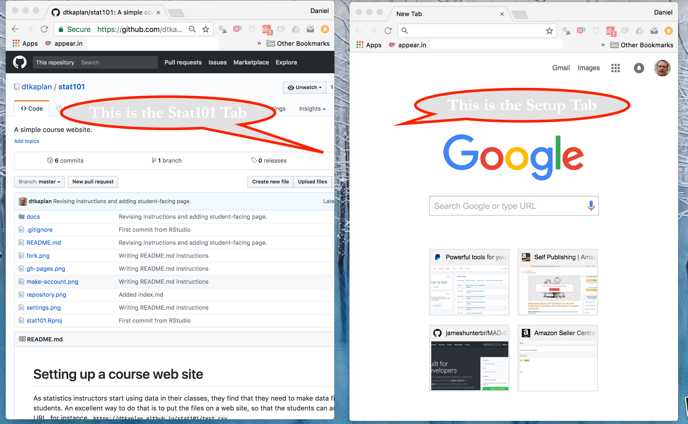
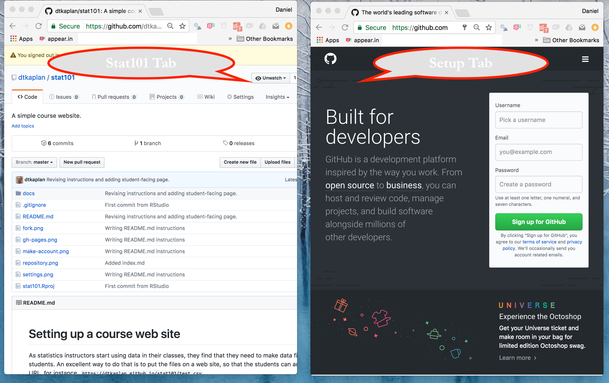

# Setting up a course web site

As statistics instructors start using data in their classes, they find that they need to make data files available to students. An excellent way to do that is to put the files on a web site, so that the students can access them with a URL, for instance, `https://dtkaplan.github.io/stat101/test.csv`.

Many instructors don't have a web server available to them and aren't sure how to set up a web site. The point of this repository is to help you set up your own course web site on which you can place data files, etc. so that your students can easily get to them.

You don't need to know even what a "repository" is. You'll be able to add files to your web site and edit documents from an ordinary brower.

The main resource we'll use is called *GitHub*. This is a free service that's very widely used by software engineers. We won't have to do any engineering, but you'll have to follow a few instructors.

## Setting up your web site

Right now you are looking at a tab in your browser. For the sake of simplicity, let's call this the "Stat101 Tab." Since you will want to refer to these instructions while you are doing your setup, you should open another tab in your browser, which for simplicity we'll call the "Setup Tab." You will want to have both tabs available to you so that you can go back and forth. You might, for instance, put them side by side on your screen. Like this:



1. You will need a GitHub account. You just have to set this up once, and it's the same kind of thing as you do all the time when you set up a new account on some service. To set up your account, point the "Setup Tab" to `github.com`. You'll get a page like the following. 
    
     
  
    
    Go ahead and make an account. Some tips:    
    * GitHub is very popular, so your first choice of account name may not be available. Whatever you choose, make it short and professional. For instance, **don't** use an account name like `party_guy`. If you do, you will find your students having to refer to URLs like `party_guy.github.io/stat101/exam_data.csv`, which they might not take very seriously.
    * Make sure to keep track of your account name and password. You're going to be needing them often.
        
    Now that you have a GitHub account ...
2. Staying in the Setup Tab, go to `github.com` and login to github using the ID and password you just created. 
3. Direct the Setup Tab to the same URL <http://github.com/dtkaplan/stat101` that has the instructions that you've been reading. The consequence of this is that the Setup Tab will have contents identical to the Stat101 Tab. (I know this seems odd, but stay with me.) 

    The top of both tabs will look like this:
    
    

4. Within the Setup Tab, press the "Fork" button. (If you didn't login as you were supposed to in step (2), you will be asked to login to GitHub. Then you'll have to do step (3) again.)
    - After you successfully complete the last step, you'll get a brief message saying that your copy of the repository is being created.
    
5. Having successfully completed (4), you will notice that the Setup Tab looks just like the Stat101 Tab. But not quite. The Setup Tab will have your Github ID instead of `dtkaplan`.
    
>  What you've now accomplished is to set up your own "repository" which contains your new web site. But the site is not yet activated, so we'll need to do that first.
    
6. Notice some things about the web page you are looking at in the Setup Tab. First, the URL of that page will be `github.com/`*your_user_ID*`/stat101`. Second the top of the page will look like this (except it won't say `dtkaplan`, it will have your own GitHub ID):

    
    
    * One of the tabs *within* the page is called "Settings." Go there.
    
7. Right near the top of the Settings tab is a label "Repository Name." The box will contain `stat101`. Change this to something that's suitable for your own course. Keep the name short and don't put any spaces in the name. If your course is actually called "Stat101", then you can keep the name. Otherwise change it to "Math2330" or "Stat10" or whatever is appropriate for your course at your institution. Press the "Rename" button.
8. Stay on the "Settings" tab, but scroll down until you see a section that looks like this:

    
    
Yours will be a little different. In particular, in the place where the image above says "Master Branch /docs folder," your page will say "None." Change the "None" to "Master Branch /docs folder" and press save.    

9. Scroll back up to the top of the page. At the top left will be *your* user name followed by *your* course name. Click on the course name and you'll come to a page that looks like this:
    


----------

> Congratulations! Your web site is now created! The address of your new web site will be displayed just above the "Master Branch /docs folder" button. It will be something like `https://dtkaplan.github.io/stat101`, but with your own GitHub user ID and course name.

## Getting oriented

When you are setting up your repository, you will be logged into GitHub and at a URL like this: `github.com/`*your_user_ID*`/`*your_course_name*.

When your students look at the repository, or when you make links to data files, etc., the URL will look like *your_user_ID*`.github.io/`*your_course_name*. Make sure it's clear to you how the GitHub user URL differs from the URL for students.

We're going to do some setup for your site, e.g. customizing the front page, adding data files, etc. So check that your Setup Tab is on the GitHub user site: `github.com/`*your_user_ID*`/`*your_course_name*. 

You can see a list of files, starting with a folder called "docs". The docs folder is where you will put all of the materials for your web site. Click on the name "docs" and you will see what files are already in the directory.  There are two:

- `test.csv` - a really small CSV data file
- `index.md` - a text file containing the front page of your new site.

What might confuse you is that the site URL from the students' point of view is something like `http://`*your_user_ID*`.github.io/`*your_course_name*, which does not include the word `docs`. Get used to it. The URL really does point to the `docs` directory. And, since there is a file called `index.md` in the `docs` directory, per the standard behaviour of web sites the contents of `index.md` are what will be displayed when someone points their browser to your `github.io` site.

## Customizing your site

Mostly, you're going to do two things with your site:

1. Upload data files from your own computer into the `docs` folder on your site. Conveniently, there is an "Upload Files" button just for this purpose.
2. Edit the `index.md` file. To do this, click on the name `index.md`, which will open the file. You will see a little pencil icon; press that to edit the file. When you're done with your edits, scroll down and press the green "Commit changes" button. That simply saves your work. As soon as you've done this, the modified page is live on your web site, but it might take a few minutes and a refresh of your browser to see it.

## Putting links to data files on your own course web site

If you are going to use your site to provide student access to data sets of particular interest to you, you will want to put links and instructions on your course web site.

The markup that you include in your `index.md` file (in the `docs/` directory) might look like this:

````
## Data files

Data files for this week:

- `https://dtkaplan.github.io/stat101/test.csv`

To create the data table in your R session, copy and paste 
this command into your console:

```r
My_data <- read.csv("https://dtkaplan.github.io/stat101/test.csv")
```
````


